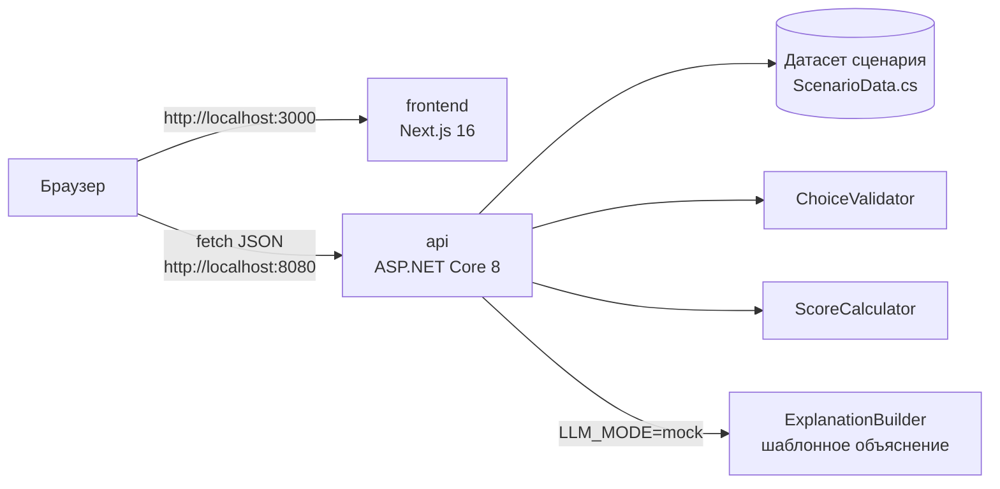

# Аким на 5 часов — AI-симулятор городских решений

## 1. Описание и назначение

Спецтрек Astana Innovations. Городу нужно понимать, как распределение ограниченного бюджета между мерами повлияет на качество жизни в районах, до того как деньги потрачены. Пользователь выбирает пять мер из 14 в рамках бюджета 100 условных единиц, при необходимости указывает район, и получает изменение Astana Quality of Life Score по городу и по каждому из пяти районов на горизонте 8 кварталов. Балл детерминированно считает C# API по правилам синтетического датасета. Объяснение (итог, сильные стороны, риски, рекомендации) строится только по уже посчитанным числам и никогда их не меняет. По умолчанию оно работает в режиме `LLM_MODE=mock`: детерминированный шаблон без внешних сервисов и ключей.

Исходные материалы: [`docs/reference/challenge-task.docx`](docs/reference/challenge-task.docx), [`docs/reference/district-dataset.docx`](docs/reference/district-dataset.docx). Контракт API: [`docs/api.md`](docs/api.md).

## Текущий статус

На базе коммита `42afd17` реализованы API сценария и оценки, серверная валидация, расчёт Score, шаблонное объяснение, Swagger и контейнерный запуск. Frontend пока содержит стартовую страницу с заголовком и описанием. Выбор мероприятий и экран результата ещё должны быть реализованы ролью 2; полный браузерный сценарий пока не принят.

23 сентября 2026 года при интеграционной проверке получены следующие результаты:

| Проверка | Фактический результат |
| --- | --- |
| Production-сборка .NET API и Next.js | Успешно |
| Проверка TypeScript в сборке и `npm run lint` | Успешно |
| Healthcheck обоих контейнеров | `healthy` |
| `GET /health` и главная страница frontend | `200` |
| `GET /api/scenario` | 5 районов, 14 мер, базовый Score `52.56` |
| Swagger | Оба маршрута scenario/evaluate присутствуют в схеме |
| Контрольный набор | `spent=95`, `remaining=5`, `score=56.54` |
| Набор с перерасходом | `422 BUDGET_EXCEEDED` |
| Набор с M1 и M3 | `400 INCOMPATIBLE_MEASURES` |
| Запуск без ключа | Проверен с `LLM_MODE=mock` и пустым `OPENAI_API_KEY` |

Контейнерная проверка выполнена в WSL Arch Linux на отдельных тестовых портах 18080 и 13000. Значения по умолчанию для команд ниже — 8080 и 3000. Финальный запуск именно в WSL Ubuntu и полный сценарий в браузере остаются отдельными пунктами приёмки.

## 2. Архитектура



| Сервис | Роль |
| --- | --- |
| `frontend` | Сейчас — стартовая страница. Целевая функция — выбор мер и районов, показ Score и объяснения. Для подключения используется прямой browser fetch по `NEXT_PUBLIC_API_URL`. |
| `api` | Отдаёт сценарий (`GET /api/scenario`), проверяет выбор (бюджет, категории, совместимость, район) и считает Score (`POST /api/simulations/evaluate`), затем добавляет объяснение. Swagger на `/swagger`. |

База данных и кэш не используются: данные сценария фиксированы, результаты не сохраняются.

Целевой поток после подключения интерфейса: frontend загружает сценарий → пользователь выбирает меры → API валидирует и рассчитывает показатели → строит объяснение по уже посчитанным числам → frontend показывает результат.

Формула (из `docs/reference/district-dataset.docx`): `score = 0.7 × средневзвешенная оценка районов + 0.3 × оценка самого слабого района − 1.0 × число значений ниже 40`. Эффект меры уменьшается на задержку: `effect × (8 − lag) / 8`. Подробно — в [`docs/api.md`](docs/api.md).

Правила выбора: ровно пять разных мер, не более двух из одного направления и суммарная стоимость не выше 100. Для районной меры обязателен `districtId`, у городской меры это поле в запросе не указывается. Несовместимые пары отклоняет API; невалидный набор не получает Score. Все десять показателей имеют шкалу 0–100, большее значение означает лучший результат.

Текущий ответ API содержит показатели и баллы районов до/после, расходы, разбор Score, применённые синергии и объяснение. Отдельный список применённых эффектов каждой меры пока отсутствует в контракте. Его добавление относится к роли 1; фронтенд не должен рассчитывать модель самостоятельно.

## 3. Технологии

| Слой | Технология | Версия |
| --- | --- | --- |
| Backend | .NET / ASP.NET Core Minimal API | 8.0 |
| Документация API | Swashbuckle.AspNetCore (Swagger UI) | 10.2.3 |
| Frontend | Next.js | 16.3.6 |
| UI | React / React DOM | 19.2.8 |
| Язык frontend | TypeScript | 5.x |
| Среда frontend | Node.js (образ `node:22-alpine`) | 22 |
| Образы backend | `mcr.microsoft.com/dotnet/sdk:8.0-alpine`, `aspnet:8.0-alpine` | 8.0 |
| Запуск | Docker Compose | v2 |

## 4. Требования и зависимости

- Docker 24+ с Docker Compose v2 (`docker compose version`).
- Свободные порты 8080 и 3000.
- Доступ в интернет при первой сборке (образы Docker, пакеты NuGet и npm).
- Ключи и личные подписки не нужны.

В WSL Ubuntu включите интеграцию Docker Desktop с дистрибутивом Ubuntu и выполняйте команды ниже в его терминале. Проверка окружения: `docker info` и `docker compose version`.

Если Ubuntu ещё не подключена к Docker Desktop, сначала проверьте доступные дистрибутивы из PowerShell:

```powershell
wsl --list --verbose
```

Затем в терминале выбранного WSL-дистрибутива проверьте Docker:

```bash
docker info
docker compose version
```

Для локальной разработки без Docker (необязательно): .NET SDK 8 и Node.js 22. При контейнерном запуске устанавливать их отдельно в Windows или WSL не требуется.

## 5. Установка

```bash
git clone https://github.com/BAITC-Hacks/hack-4c816c70-team.git
cd hack-4c816c70-team
cp .env.example .env
```

Если проект уже скачан, перейдите в корень существующей копии — папку с `docker-compose.yml`. Путь Windows `C:\...` внутри WSL начинается с `/mnt/c/...`; путь с пробелами заключайте в кавычки.

Перед обновлением проверьте `git status`. Если есть собственные изменения, сначала сохраните их в коммите. Для чистой рабочей копии:

```bash
git pull --ff-only
test -f .env || cp .env.example .env
```

Вторая команда создаёт `.env` только при его отсутствии. После pull повторите `docker compose up --build`, чтобы запустить обновлённый код.

## 6. Параметры окружения

Все переменные имеют значения по умолчанию в `docker-compose.yml`; `.env` нужен только для их изменения.

| Переменная | Обязательна | Пример | Описание |
| --- | --- | --- | --- |
| `API_PORT` | нет | `8080` | Порт API на хосте |
| `FRONTEND_PORT` | нет | `3000` | Порт frontend на хосте |
| `ASPNETCORE_ENVIRONMENT` | нет | `Production` | Окружение ASP.NET Core |
| `NEXT_PUBLIC_API_URL` | нет | `http://localhost:8080` | Адрес API для браузера; встраивается при сборке frontend |
| `LLM_MODE` | нет | `mock` | Режим объяснения. `mock` — детерминированный шаблон без внешних вызовов, единственный реализованный режим |
| `OPENAI_API_KEY` | нет | пусто | Зарезервирован для будущего подключения LLM. В `mock` не используется и передаётся только API |

Ключи API и секреты не нужны: API работает в `LLM_MODE=mock`. Файл `.env` исключён из Git; оставьте `OPENAI_API_KEY=`. Браузер обращается к API напрямую через `NEXT_PUBLIC_API_URL`; Next rewrites для MVP не используются.

## 7. Запуск

```bash
docker compose up --build
```

Первая сборка занимает несколько минут. Когда оба контейнера в статусе `healthy` (`docker compose ps`):

- Frontend: http://localhost:3000
- API: http://localhost:8080
- Swagger: http://localhost:8080/swagger
- Health: http://localhost:8080/health

API слушает порт 8080 внутри контейнера, frontend — 3000. Compose сначала ждёт успешный healthcheck API, затем запускает frontend. Сервисы подключены к общей Docker-сети; внутреннее имя `api` не является адресом для браузера.

Для работы в фоне:

```bash
docker compose up --build --detach
docker compose ps
```

Остановка с сохранением контейнеров: `docker compose stop`. Остановка с удалением контейнеров и сети проекта: `docker compose down`.

## 8. Проверка основного сценария

Вход в систему не требуется. Следующие три шага описывают приёмку после завершения интерфейса ролью 2. Пока frontend содержит стартовую страницу, выполняйте API-проверки из терминала WSL или через Swagger.

1. Откройте http://localhost:3000.
2. Выберите пять мер, для районных мер укажите район; суммарная стоимость не больше 100.
3. Запустите расчёт: интерфейс показывает Score города до и после, изменения по районам, применённые синергии и объяснение.

Проверка API из терминала:

```bash
curl http://localhost:8080/health
```

Ожидаемый ответ: `{"status":"ok"}`.

```bash
curl http://localhost:8080/api/scenario
```

Ожидаемый ответ: `budget` = 100, `horizonQuarters` = 8, `choicesRequired` = 5, `baselineScore` = 52.56, 10 индикаторов, 5 районов, 14 мер, 3 синергии, 3 несовместимости.

```bash
curl -X POST http://localhost:8080/api/simulations/evaluate \
  -H "Content-Type: application/json" \
  -d '{"choices":[{"measureId":"M7","districtId":"nura"},{"measureId":"M8","districtId":"nura"},{"measureId":"M10","districtId":"nura"},{"measureId":"M12"},{"measureId":"M5","districtId":"saryarka"}]}'
```

Ожидаемый ответ `200`: `spent` = 95, `remaining` = 5, `baselineScore` = 52.56, `score` = 56.54, `breakdown` = `{"averageScore":58.08,"minDistrictScore":52.96,"criticalCount":0}`, пять районов в `districts`, синергия M10 + M12 в Нуре в `appliedSynergies` и заполненный `explanation`.

Проверка валидации (превышение бюджета):

```bash
curl -i -X POST http://localhost:8080/api/simulations/evaluate \
  -H "Content-Type: application/json" \
  -d '{"choices":[{"measureId":"M2"},{"measureId":"M3","districtId":"yesil"},{"measureId":"M13","districtId":"yesil"},{"measureId":"M7","districtId":"nura"},{"measureId":"M6"}]}'
```

Ожидаемый ответ `422` с `{"error":{"code":"BUDGET_EXCEEDED","message":"..."}}`. Остальные ошибки выбора возвращают `400`; коды перечислены в [`docs/api.md`](docs/api.md).

Проверка несовместимости при допустимом бюджете (84 единицы, пять разных мер):

```bash
curl -i -X POST http://localhost:8080/api/simulations/evaluate \
  -H "Content-Type: application/json" \
  -d '{"choices":[{"measureId":"M1","districtId":"nura"},{"measureId":"M3","districtId":"yesil"},{"measureId":"M10","districtId":"nura"},{"measureId":"M11","districtId":"nura"},{"measureId":"M12"}]}'
```

Ожидаемый ответ `400` с `error.code = "INCOMPATIBLE_MEASURES"`: M1 и M3 запрещены совместно даже в разных районах. Для проверки неверного количества отправьте `{"choices":[]}`; ожидается `400 WRONG_CHOICE_COUNT`.

В каждом ошибочном ответе должны быть стабильный `error.code` и понятный `error.message`. Ответ не должен содержать результат оценки. Полный перечень кодов и порядок проверки правил — в [контракте API](docs/api.md).

## Диагностика и повторная проверка

Для статуса и последних логов:

```bash
docker compose ps --all
docker compose logs --tail=100 api frontend
```

После изменения `NEXT_PUBLIC_API_URL` повторите `docker compose up --build`: адрес встраивается в клиентскую сборку. При изменении `API_PORT` обновите этот адрес. CORS API сейчас разрешает `http://localhost:3000`; другой порт frontend требует согласованного изменения CORS.

| Симптом | Что проверить |
| --- | --- |
| `docker: command not found` в WSL | Docker Desktop запущен, интеграция включена для того дистрибутива, где открыт терминал |
| Docker-клиент не может подключиться к daemon | Вывод `docker info`, состояние Docker Desktop или Docker Engine |
| `port is already allocated` | Освободите порт либо измените `API_PORT`; одновременно обновите `NEXT_PUBLIC_API_URL` и пересоберите frontend |
| Контейнер `unhealthy` или `Exited` | `docker compose ps --all` и логи соответствующего сервиса; сначала проверьте API |
| Главная страница открывается, но API недоступен | Ответ `/health`, опубликованный порт API и адрес `NEXT_PUBLIC_API_URL` в сборке |
| Ошибка CORS в браузере | Для текущего API допустим origin `http://localhost:3000`; `127.0.0.1` и другой порт — другие origins |
| `404` на `/api/scenario` | В истории должен быть коммит API `8117017` или новее; после pull выполните сборку заново |
| Отображаются только заголовок и описание | Это текущее состояние стартового frontend; реализация экранов ещё ожидается |

Для повторного запуска без существующих контейнеров остановите текущий процесс и выполните:

```bash
docker compose down --remove-orphans
docker compose up --build
```

Команда `down` удаляет контейнеры и сеть этого Compose-проекта; исходники и образы остаются. Результаты симуляций не сохраняются в базе данных.

## Приёмка роли 3 перед сдачей

- [ ] Выполнить запуск в WSL Ubuntu из чистой копии проекта по разделам 4–7.
- [ ] Дождаться `healthy` у обоих сервисов и открыть Swagger.
- [ ] Повторить контрольный набор: `52.56 → 56.54`, расходы `95`, остаток `5`.
- [ ] Повторить серверные проверки перерасхода, несовместимости, повтора, неверного района и количества мер.
- [ ] Пройти выбор пяти мер и просмотр результата в готовом браузерном интерфейсе.
- [ ] Проверить скрытие выбора района для городской меры и сообщения об ошибках API.
- [ ] Повторить запуск с `LLM_MODE=mock` и пустым `OPENAI_API_KEY`.
- [ ] Проверить, что `.env` и ключи не попали в коммит, а сторонние компоненты перечислены в `THIRD_PARTY.md`.

Это чек-лист финального прогона; результаты уже выполненной промежуточной проверки приведены в начале README. Для передачи ошибки участнику укажите коммит, окружение, точную команду или шаги, ожидаемый и фактический результат, HTTP-код и `error.code`. Прикладывайте только относящиеся к ошибке строки логов без секретов.

## Команда

| Участник | Роль | Вклад |
| --- | --- | --- |
| Тамерлан | Backend, C# | API, правила выбора, расчёт Score, объяснение, Swagger, контракт `docs/api.md` |
| Фронтенд-разработчик | Frontend, Next.js | Интерфейс выбора мер и экран результата |
| Участник по серверу и интеграции | DevOps | Docker Compose, окружение, README, сквозная проверка |

## Сторонние компоненты

См. [`THIRD_PARTY.md`](THIRD_PARTY.md).
