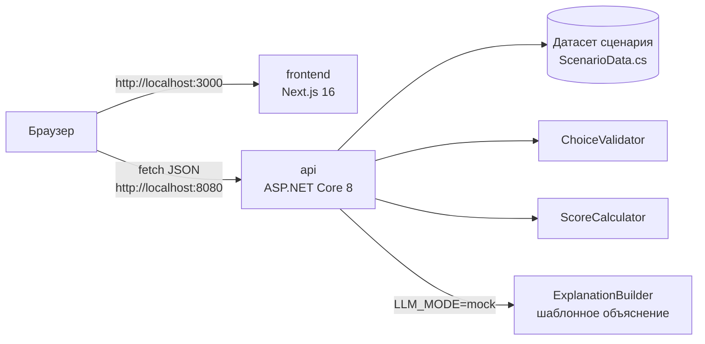

# Аким на 5 часов — AI-симулятор городских решений

## 1. Описание и назначение

Спецтрек Astana Innovations. Городу нужно понимать, как распределение ограниченного бюджета между мерами повлияет на качество жизни в районах, до того как деньги потрачены. Пользователь выбирает пять мер из 14 в рамках бюджета 100 условных единиц, при необходимости указывает район, и получает изменение Astana Quality of Life Score по городу и по каждому из пяти районов на горизонте 8 кварталов. Балл детерминированно считает C# API по правилам синтетического датасета. Объяснение (итог, сильные стороны, риски, рекомендации) строится только по уже посчитанным числам и никогда их не меняет. По умолчанию оно работает в режиме `LLM_MODE=mock`: детерминированный шаблон без внешних сервисов и ключей.

Исходные материалы: [`docs/reference/challenge-task.docx`](docs/reference/challenge-task.docx), [`docs/reference/district-dataset.docx`](docs/reference/district-dataset.docx). Контракт API: [`docs/api.md`](docs/api.md).

## 2. Архитектура



| Сервис | Роль |
| --- | --- |
| `frontend` | Выбор пяти мер и районов, показ Score до/после и объяснения. Браузер обращается к API по `NEXT_PUBLIC_API_URL`. |
| `api` | Отдаёт сценарий (`GET /api/scenario`), проверяет выбор (бюджет, категории, совместимость, район) и считает Score (`POST /api/simulations/evaluate`), затем добавляет объяснение. Swagger на `/swagger`. |

База данных и кэш не используются: данные сценария фиксированы, результаты не сохраняются.

Поток: frontend загружает сценарий → пользователь выбирает меры → API валидирует и рассчитывает показатели → строит объяснение по уже посчитанным числам → frontend показывает результат.

Формула (из `docs/reference/district-dataset.docx`): `score = 0.7 × средневзвешенная оценка районов + 0.3 × оценка самого слабого района − 1.0 × число значений ниже 40`. Эффект меры уменьшается на задержку: `effect × (8 − lag) / 8`. Подробно — в [`docs/api.md`](docs/api.md).

## 3. Технологии

| Слой | Технология | Версия |
| --- | --- | --- |
| Backend | .NET / ASP.NET Core Minimal API | 8.0 |
| Документация API | Swashbuckle.AspNetCore (Swagger UI) | 10.2.3 |
| Frontend | Next.js | 16.3.6 |
| UI | React / React DOM | 19.2.8 |
| Язык frontend | TypeScript | 5.x |
| Среда frontend | Node.js (образ `node:22-alpine`) | 22 |
| Образы backend | `mcr.microsoft.com/dotnet/sdk:8.0-alpine`, `aspnet:8.0-alpine` | 8.0 |
| Запуск | Docker Compose | v2 |

## 4. Требования и зависимости

- Docker 24+ с Docker Compose v2 (`docker compose version`).
- Свободные порты 8080 и 3000.
- Доступ в интернет при первой сборке (образы Docker, пакеты NuGet и npm).
- Ключи и личные подписки не нужны.

В WSL Ubuntu включите интеграцию Docker Desktop с дистрибутивом Ubuntu и выполняйте команды ниже в его терминале. Проверка окружения: `docker info` и `docker compose version`.

Для локальной разработки без Docker (необязательно): .NET SDK 8 и Node.js 22.

## 5. Установка

```bash
git clone https://github.com/BAITC-Hacks/hack-4c816c70-team.git
cd hack-4c816c70-team
cp .env.example .env
```

## 6. Параметры окружения

Все переменные имеют значения по умолчанию в `docker-compose.yml`; `.env` нужен только для их изменения.

| Переменная | Обязательна | Пример | Описание |
| --- | --- | --- | --- |
| `API_PORT` | нет | `8080` | Порт API на хосте |
| `FRONTEND_PORT` | нет | `3000` | Порт frontend на хосте |
| `ASPNETCORE_ENVIRONMENT` | нет | `Production` | Окружение ASP.NET Core |
| `NEXT_PUBLIC_API_URL` | нет | `http://localhost:8080` | Адрес API для браузера; встраивается при сборке frontend |
| `LLM_MODE` | нет | `mock` | Режим объяснения. `mock` — детерминированный шаблон без внешних вызовов, единственный реализованный режим |
| `OPENAI_API_KEY` | нет | пусто | Зарезервирован для будущего подключения LLM. В `mock` не используется и передаётся только API |

Ключи API и секреты не нужны: API работает в `LLM_MODE=mock`. Файл `.env` исключён из Git; оставьте `OPENAI_API_KEY=`. Браузер обращается к API напрямую через `NEXT_PUBLIC_API_URL`; Next rewrites для MVP не используются.

## 7. Запуск

```bash
docker compose up --build
```

Первая сборка занимает несколько минут. Когда оба контейнера в статусе `healthy` (`docker compose ps`):

- Frontend: http://localhost:3000
- API: http://localhost:8080
- Swagger: http://localhost:8080/swagger
- Health: http://localhost:8080/health

Остановка: `docker compose down`.

## 8. Проверка основного сценария

Вход в систему не требуется. Следующие три шага описывают целевой сценарий: в полученном коммите `ef46722` frontend ещё содержит стартовую страницу, поэтому полный браузерный сценарий ждёт реализации роли 2. API-проверки выполняются независимо.

1. Откройте http://localhost:3000.
2. Выберите пять мер, для районных мер укажите район; суммарная стоимость не больше 100.
3. Запустите расчёт: интерфейс показывает Score города до и после, изменения по районам, применённые синергии и объяснение.

Проверка API из терминала:

```bash
curl http://localhost:8080/health
```

Ожидаемый ответ: `{"status":"ok"}`.

```bash
curl http://localhost:8080/api/scenario
```

Ожидаемый ответ: `budget` = 100, `horizonQuarters` = 8, `choicesRequired` = 5, `baselineScore` = 52.56, 10 индикаторов, 5 районов, 14 мер, 3 синергии, 3 несовместимости.

```bash
curl -X POST http://localhost:8080/api/simulations/evaluate \
  -H "Content-Type: application/json" \
  -d '{"choices":[{"measureId":"M7","districtId":"nura"},{"measureId":"M8","districtId":"nura"},{"measureId":"M10","districtId":"nura"},{"measureId":"M12"},{"measureId":"M5","districtId":"saryarka"}]}'
```

Ожидаемый ответ `200`: `spent` = 95, `remaining` = 5, `baselineScore` = 52.56, `score` = 56.54, `breakdown` = `{"averageScore":58.08,"minDistrictScore":52.96,"criticalCount":0}`, пять районов в `districts`, синергия M10 + M12 в Нуре в `appliedSynergies` и заполненный `explanation`.

Проверка валидации (превышение бюджета):

```bash
curl -i -X POST http://localhost:8080/api/simulations/evaluate \
  -H "Content-Type: application/json" \
  -d '{"choices":[{"measureId":"M2"},{"measureId":"M3","districtId":"yesil"},{"measureId":"M13","districtId":"yesil"},{"measureId":"M7","districtId":"nura"},{"measureId":"M6"}]}'
```

Ожидаемый ответ `422` с `{"error":{"code":"BUDGET_EXCEEDED","message":"..."}}`. Остальные ошибки выбора возвращают `400`; коды перечислены в [`docs/api.md`](docs/api.md).

## Диагностика и повторная проверка

Для статуса и последних логов:

```bash
docker compose ps --all
docker compose logs --tail=100 api frontend
```

После изменения `NEXT_PUBLIC_API_URL` повторите `docker compose up --build`: адрес встраивается в клиентскую сборку. При изменении `API_PORT` обновите этот адрес. CORS API сейчас разрешает `http://localhost:3000`; другой порт frontend требует согласованного изменения CORS.

Для повторного запуска без существующих контейнеров остановите текущий процесс и выполните:

```bash
docker compose down --remove-orphans
docker compose up --build
```

Команда `down` удаляет контейнеры и сеть этого Compose-проекта; исходники и образы остаются. Результаты симуляций не сохраняются в базе данных.

## Команда

| Участник | Роль | Вклад |
| --- | --- | --- |
| Тамерлан | Backend, C# | API, правила выбора, расчёт Score, объяснение, Swagger, контракт `docs/api.md` |
| Фронтенд-разработчик | Frontend, Next.js | Интерфейс выбора мер и экран результата |
| Участник по серверу и интеграции | DevOps | Docker Compose, окружение, README, сквозная проверка |

## Сторонние компоненты

См. [`THIRD_PARTY.md`](THIRD_PARTY.md).
