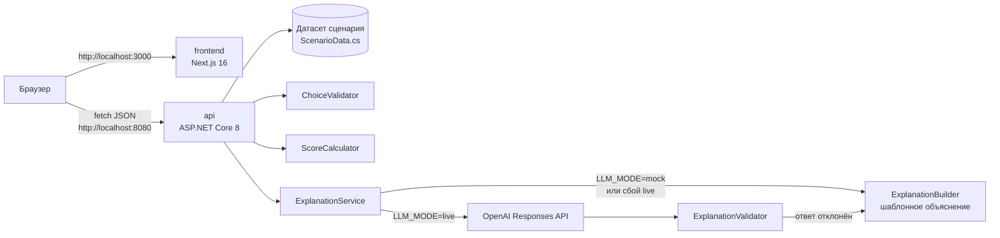

# Аким на 5 часов — AI-симулятор городских решений

## 1. Описание и назначение

Спецтрек Astana Innovations. Городу нужно понимать, как распределение ограниченного бюджета между мерами повлияет на качество жизни в районах, до того как деньги потрачены. Пользователь выбирает пять мер из 14 в рамках бюджета 100 условных единиц, при необходимости указывает район, и получает изменение Astana Quality of Life Score по городу и по каждому из пяти районов на горизонте 8 кварталов. Балл детерминированно считает C# API по правилам синтетического датасета. Объяснение (итог, сильные стороны, риски, рекомендации) строится только по уже посчитанным числам и никогда их не меняет. По умолчанию оно работает в режиме `LLM_MODE=mock`: детерминированный шаблон без внешних сервисов и ключей. В режиме `LLM_MODE=live` OpenAI Responses API определяет порядок важности проверенных утверждений о сильных сторонах и рисках. Весь текст, включая итог и рекомендации по замене мер, формирует сервер; при ошибке модели используется порядок по умолчанию. Числовой результат считает только сервер.

Исходные материалы: [`docs/reference/challenge-task.docx`](docs/reference/challenge-task.docx), [`docs/reference/district-dataset.docx`](docs/reference/district-dataset.docx). Контракт API: [`docs/api.md`](docs/api.md).

## Текущий статус

В текущем коде реализованы API сценария и оценки, серверная валидация, расчёт Score, объяснение в режимах mock/live, Swagger и контейнерный запуск. Frontend содержит шаги «Обзор», «Решения» и «Результат», загрузку сценария и отправку выбора в API. Браузерный сценарий раздела 8 пройден 23 сентября 2026 года на коммите `2820666`; результаты, скриншоты и найденные дефекты — в [`docs/reports/e2e.md`](docs/reports/e2e.md). Отдельно полный сценарий проверен на публичном сервере Brev в режиме mock; настройка и результаты описаны в разделе «Развёртывание на NVIDIA Brev».

23 сентября 2026 года при интеграционной проверке получены следующие результаты:

| Проверка | Фактический результат |
| --- | --- |
| Production-сборка .NET API и Next.js | Успешно |
| Проверка TypeScript в сборке и `npm run lint` | Успешно |
| Healthcheck обоих контейнеров | `healthy` |
| `GET /health` и главная страница frontend | `200` |
| `GET /api/scenario` | 5 районов, 14 мер, базовый Score `52.56` |
| Swagger | Оба маршрута scenario/evaluate присутствуют в схеме |
| Контрольный набор | `spent=95`, `remaining=5`, `score=56.54` |
| Набор с перерасходом | `422 BUDGET_EXCEEDED` |
| Набор с M1 и M3 | `400 INCOMPATIBLE_MEASURES` |
| Запуск без ключа | Проверен с `LLM_MODE=mock` и пустым `OPENAI_API_KEY` |
| Чистый клон `aafbf1a` в WSL Ubuntu, mock без ключа | `cp .env.example .env`, отдельный Compose-проект на 8081/3001: оба сервиса `healthy`, Swagger `200`, эталон `56.54`, 95/5, `explanationSource: "mock"`, в браузере тот же результат |
| Браузерный прогон предыдущего интерфейса (2820666/a30ea47) | Эталон 52,56 → 56,54, 95/5, районы, синергия и объяснение проверены. На 390 px был найден overflow 4 px. Повторная проверка нового frontend выполнена на 1499111 и приведена следующей строкой |
| Браузер, новый интерфейс `1499111` (`/`, `/decisions`, `/results`) | Эталон 52,56 → 56,54, 95/100, остаток 5; 10 сильных сторон, 2 риска и 4 рекомендации читаются на 1440 и 390 px; слабейший район Нура (52.96), «M5 (Сарыарка) на M3 (Нура)». Горизонтальной прокрутки нет, «5 из 5» в одну строку, `favicon.ico` → 200, выбор сохраняется при переходах и перезагрузке. В этом прогоне модель пропустила ID в порядке утверждений, сервер вернул `mock` с подписью «Шаблонное объяснение» ([отчёт](docs/reports/e2e.md), дефект 7) |
| Live после перехода к каталогу утверждений | Один эталонный POST через туннель: HTTP 200 за 2,52 с, Score 56.54, расходы 95, остаток 5, source=llm. 10 сильных сторон и 2 риска; слабейший район — Нура 52.96. Все формулировки серверные, AI выбирает порядок |
| Публичный API из браузера со страницы `localhost:3000` | `GET /api/scenario` → `200`; эталонный `POST /api/simulations/evaluate` → `200` за 4,8 с, score 56.54, `explanationSource: "llm"`; CORS разрешён |

Контейнерная проверка выполнена в WSL Arch Linux на отдельных тестовых портах 18080 и 13000. Значения по умолчанию для команд ниже — 8080 и 3000. Браузерная проверка выполнена в WSL Ubuntu-24.04 на портах 8080 и 3000, запуск из чистой копии в mock — там же на 8081 и 3001 ([отчёт](docs/reports/e2e.md)). Сервер и полный браузерный сценарий также проверены на Ubuntu 22.04 в Brev через публичный HTTPS-адрес.

## 2. Архитектура



| Сервис | Роль |
| --- | --- |
| `frontend` | Обзор районов, выбор мер и районов, показ Score и объяснения. Браузер обращается к API через `NEXT_PUBLIC_API_URL`. |
| `api` | Отдаёт сценарий (`GET /api/scenario`), проверяет выбор (бюджет, категории, совместимость, район) и считает Score (`POST /api/simulations/evaluate`), затем добавляет объяснение. Swagger на `/swagger`. |

База данных и кэш не используются: данные сценария фиксированы, результаты не сохраняются.

Основной поток: frontend загружает сценарий → пользователь выбирает меры → API валидирует и рассчитывает показатели → строит объяснение по уже посчитанным числам → frontend показывает результат.

Формула (из `docs/reference/district-dataset.docx`): `score = 0.7 × средневзвешенная оценка районов + 0.3 × оценка самого слабого района − 1.0 × число значений ниже 40`. Эффект меры уменьшается на задержку: `effect × (8 − lag) / 8`. Подробно — в [`docs/api.md`](docs/api.md).

Правила выбора: ровно пять разных мер, не более двух из одного направления и суммарная стоимость не выше 100. Для районной меры обязателен `districtId`, у городской меры это поле в запросе не указывается. Несовместимые пары отклоняет API; невалидный набор не получает Score. Все десять показателей имеют шкалу 0–100, большее значение означает лучший результат.

Текущий ответ API содержит показатели и баллы районов до/после, расходы, разбор Score, применённые синергии и объяснение. Отдельный список применённых эффектов каждой меры пока отсутствует в контракте. Его добавление относится к роли 1; фронтенд не должен рассчитывать модель самостоятельно.

### Объяснение в режиме live

В модель передаются рассчитанные факты и каталог серверных утверждений: ID и готовый текст. Модель возвращает только strengthOrder и riskOrder — порядок ID сильных сторон и рисков. Запрос использует store: false и строгую JSON-схему; ID ограничены своей секцией. Валидатор проверяет полную перестановку: без неизвестных ID, дублей, пропусков и лишних полей. Сервер подставляет готовые тексты; summary и recommendations также серверные. Внешний ответ explanation сохраняет четыре поля. Рекомендации строятся из проверенных замен с явными исходным и целевым районами.

Общий предел AI-анализа — **60 секунд**, включая все попытки и паузы. Сетевые ошибки и HTTP 408/409/429/5xx повторяются не более двух раз внутри этого предела; затем API возвращает mock. Для frontend достаточно таймаута запроса 75 секунд. Поле explanationSource равно llm, когда AI задал принятый порядок утверждений, или mock при порядке по умолчанию. Числа, связи между фактами и формулировки в обоих режимах задаёт сервер. В логах — номер попытки, HTTP-статус, время, число токенов и причина отклонения структуры; ключ, тело запроса и ответ модели не записываются.

## 3. Технологии

| Слой | Технология | Версия |
| --- | --- | --- |
| Backend | .NET / ASP.NET Core Minimal API | 8.0 |
| Документация API | Swashbuckle.AspNetCore (Swagger UI) | 10.2.3 |
| AI-объяснение | OpenAI Responses API через встроенный `HttpClient` | модель из `OPENAI_MODEL` |
| Frontend | Next.js | 16.3.6 |
| UI | React / React DOM | 19.2.8 |
| Язык frontend | TypeScript | 5.x |
| Среда frontend | Node.js (образ `node:22-alpine`) | 22 |
| Образы backend | `mcr.microsoft.com/dotnet/sdk:8.0-alpine`, `aspnet:8.0-alpine` | 8.0 |
| Запуск | Docker Compose | v2 |

## 4. Требования и зависимости

- Docker 24+ с Docker Compose v2 (`docker compose version`).
- Свободные порты 8080 и 3000.
- Доступ в интернет при первой сборке (образы Docker, пакеты NuGet и npm).
- Для `mock` ключи и личные подписки не нужны. Для `live` нужен ключ OpenAI и доступ контейнера API к `api.openai.com` или к `OPENAI_BASE_URL`.

В рабочем окружении команды выполняются внутри WSL Ubuntu-24.04, где установлен Docker Engine и Docker Compose. Docker Desktop не требуется. Доступные дистрибутивы можно проверить из PowerShell:

```powershell
wsl --list --verbose
```

Затем в терминале выбранного WSL-дистрибутива проверьте Docker:

```bash
docker info
docker compose version
```

Для локальной разработки без Docker (необязательно): .NET SDK 8 и Node.js 22. При контейнерном запуске устанавливать их отдельно в Windows или WSL не требуется.

## 5. Установка

```bash
git clone https://github.com/BAITC-Hacks/hack-4c816c70-team.git
cd hack-4c816c70-team
cp .env.example .env
```

Если проект уже скачан, перейдите в корень существующей копии — папку с `docker-compose.yml`. Путь Windows `C:\...` внутри WSL начинается с `/mnt/c/...`; путь с пробелами заключайте в кавычки.

Перед обновлением проверьте `git status`. Если есть собственные изменения, сначала сохраните их в коммите. Для чистой рабочей копии:

```bash
git pull --ff-only
test -f .env || cp .env.example .env
```

Вторая команда создаёт `.env` только при его отсутствии. После pull повторите `docker compose up --build`, чтобы запустить обновлённый код.

## 6. Параметры окружения

Для запуска в `mock` достаточно значений по умолчанию в `docker-compose.yml`; локальный `.env` нужен для изменения настроек и подключения `live`.

| Переменная | Обязательна | Пример | Описание |
| --- | --- | --- | --- |
| `API_PORT` | нет | `8080` | Порт API на хосте |
| `FRONTEND_PORT` | нет | `3000` | Порт frontend на хосте |
| `FRONTEND_ORIGIN` | нет | `http://localhost:3000` | Допустимый origin frontend для CORS, либо список через запятую. Пусто — `http://localhost:${FRONTEND_PORT}`. Для опубликованного frontend укажите его HTTPS-адрес |
| `ASPNETCORE_ENVIRONMENT` | нет | `Production` | Окружение ASP.NET Core |
| `NEXT_PUBLIC_API_URL` | нет | `http://localhost:8080` | Адрес API для браузера; встраивается при сборке frontend |
| `LLM_MODE` | нет | `mock` | `mock` — шаблон без внешних вызовов; `live` — OpenAI с возвратом к шаблону при ошибке |
| `OPENAI_API_KEY` | для `live` | пусто | Ключ OpenAI, задаётся только в локальном `.env` и передаётся только API |
| `OPENAI_MODEL` | для `live` | `gpt-4o-mini` | Имя модели, доступной выданному ключу; в коде не зашито |
| `OPENAI_BASE_URL` | нет | пусто | Пусто — `https://api.openai.com/v1/`; другой адрес для совместимого прокси или тестовой заглушки |

Без ключа API работает в `LLM_MODE=mock`. Если для `live` не задан ключ или модель, сервер пишет предупреждение при старте и возвращает шаблон. Браузер обращается к API напрямую через `NEXT_PUBLIC_API_URL`; Next rewrites для MVP не используются.

Чтобы включить `live`, задайте в локальном `.env` значения `LLM_MODE=live`, `OPENAI_API_KEY` и `OPENAI_MODEL`, затем выполните `docker compose up -d api`. Для изменения этих переменных пересборка образа не нужна. Если обновлён сам код после pull, сначала выполните `docker compose up --build -d`. Успешный ответ модели определяется по `explanationSource: "llm"`.

Файл `.env` исключён из Git. Не помещайте ключ в `.env.example` или документацию. Команды `docker compose config` и `docker inspect` могут показать значения переменных, поэтому их полный вывод нельзя публиковать.

## 7. Запуск

```bash
docker compose up --build
```

Первая сборка занимает несколько минут. Когда оба контейнера в статусе `healthy` (`docker compose ps`):

- Frontend: http://localhost:3000
- API: http://localhost:8080
- Swagger: http://localhost:8080/swagger/index.html
- Health: http://localhost:8080/health

API слушает порт 8080 внутри контейнера, frontend — 3000. Compose сначала ждёт успешный healthcheck API, затем запускает frontend. Сервисы подключены к общей Docker-сети; внутреннее имя `api` не является адресом для браузера.

Для работы в фоне:

```bash
docker compose up --build --detach
docker compose ps
```

Остановка с сохранением контейнеров: `docker compose stop`. Остановка с удалением контейнеров и сети проекта: `docker compose down`.

Имя Compose-проекта — `akim-5h`. Для второй копии на той же машине задайте другие `API_PORT`, `FRONTEND_PORT` и `NEXT_PUBLIC_API_URL`, затем запускайте с отдельным именем: `docker compose -p akim-copy up --build`. Иначе Compose пересоздаст контейнеры первой копии.

### Временный доступ к API для frontend

При запущенном API и установленном `cloudflared` выполните внутри WSL:

```bash
cloudflared tunnel --url http://localhost:8080
```

Передайте frontend-разработчику HTTPS-адрес `trycloudflare.com` из вывода. Адрес временный и работает, пока запущены туннель и API. На машине frontend задайте этот адрес как `NEXT_PUBLIC_API_URL` и пересоберите frontend. На машине API задайте `FRONTEND_ORIGIN` равным адресу страницы frontend (например, `http://localhost:3000` или опубликованному HTTPS-адресу) и выполните `docker compose up -d api`. Можно перечислить несколько origins через запятую. Адрес API-туннеля и origin страницы frontend — разные настройки.

## 8. Проверка основного сценария

Вход в систему не требуется. Ниже сценарий приёмки интерфейса; фактический прогон — в [`docs/reports/e2e.md`](docs/reports/e2e.md). Он также пройден в браузере на публичном сервере Brev. При изменениях API или интерфейса повторите проверку.

1. Откройте http://localhost:3000. На шаге «Обзор» дождитесь сценария и нажмите «Перейти к решениям».
2. На шаге «Решения» через «Добавить в решения» выберите M7, M8 и M10 для Нуры, городскую меру M12 и M5 для Сарыарки. Получится пять мер стоимостью 95.
3. Нажмите «Оценить решения» и дождитесь экрана «Ваш план оценён». Ожидаются Score `52.56 → 56.54`, расходы `95`, остаток `5`, сравнение районов, синергия M10 + M12 в Нуре и раздел «Объяснение от сервера».
4. Нажмите «Изменить решения», чтобы вернуться к выбору, или «Начать заново», чтобы сбросить план.

Проверка API из терминала:

```bash
curl http://localhost:8080/health
```

Ожидаемый ответ: `{"status":"ok"}`.

```bash
curl http://localhost:8080/api/scenario
```

Ожидаемый ответ: `budget` = 100, `horizonQuarters` = 8, `choicesRequired` = 5, `baselineScore` = 52.56, 10 индикаторов, 5 районов, 14 мер, 3 синергии, 3 несовместимости.

```bash
curl -X POST http://localhost:8080/api/simulations/evaluate \
  -H "Content-Type: application/json" \
  -d '{"choices":[{"measureId":"M7","districtId":"nura"},{"measureId":"M8","districtId":"nura"},{"measureId":"M10","districtId":"nura"},{"measureId":"M12"},{"measureId":"M5","districtId":"saryarka"}]}'
```

Ожидаемый ответ `200`: `spent` = 95, `remaining` = 5, `baselineScore` = 52.56, `score` = 56.54, `breakdown` = `{"averageScore":58.08,"minDistrictScore":52.96,"criticalCount":0}`, пять районов в `districts`, синергия M10 + M12 в Нуре в `appliedSynergies` и заполненный `explanation`; `explanationSource` = `mock` в режиме mock или при fallback, `llm` — при успешном ответе модели. Числовые поля в обоих режимах одинаковы.

Проверка валидации (превышение бюджета):

```bash
curl -i -X POST http://localhost:8080/api/simulations/evaluate \
  -H "Content-Type: application/json" \
  -d '{"choices":[{"measureId":"M2"},{"measureId":"M3","districtId":"yesil"},{"measureId":"M13","districtId":"yesil"},{"measureId":"M7","districtId":"nura"},{"measureId":"M6"}]}'
```

Ожидаемый ответ `422` с `{"error":{"code":"BUDGET_EXCEEDED","message":"..."}}`. Остальные ошибки выбора возвращают `400`; коды перечислены в [`docs/api.md`](docs/api.md).

Проверка несовместимости при допустимом бюджете (84 единицы, пять разных мер):

```bash
curl -i -X POST http://localhost:8080/api/simulations/evaluate \
  -H "Content-Type: application/json" \
  -d '{"choices":[{"measureId":"M1","districtId":"nura"},{"measureId":"M3","districtId":"yesil"},{"measureId":"M10","districtId":"nura"},{"measureId":"M11","districtId":"nura"},{"measureId":"M12"}]}'
```

Ожидаемый ответ `400` с `error.code = "INCOMPATIBLE_MEASURES"`: M1 и M3 запрещены совместно даже в разных районах. Для проверки неверного количества отправьте `{"choices":[]}`; ожидается `400 WRONG_CHOICE_COUNT`.

В каждом ошибочном ответе должны быть стабильный `error.code` и понятный `error.message`. Ответ не должен содержать результат оценки. Полный перечень кодов и порядок проверки правил — в [контракте API](docs/api.md).

## Диагностика и повторная проверка

Для статуса и последних логов:

```bash
docker compose ps --all
docker compose logs --tail=100 api frontend
```

После изменения `NEXT_PUBLIC_API_URL` повторите `docker compose up --build`: адрес встраивается в клиентскую сборку. При изменении `API_PORT` обновите этот адрес. Compose по умолчанию задаёт CORS origin как `http://localhost:${FRONTEND_PORT}`. Для другого адреса frontend задайте `FRONTEND_ORIGIN` и пересоздайте API через `docker compose up -d api`.

| Симптом | Что проверить |
| --- | --- |
| `docker: command not found` в WSL | Docker Engine и плагин Docker Compose установлены внутри нужного дистрибутива WSL |
| Docker-клиент не может подключиться к daemon | Вывод `docker info`, состояние сервиса Docker Engine в WSL |
| `port is already allocated` | Освободите порт либо измените `API_PORT`; одновременно обновите `NEXT_PUBLIC_API_URL` и пересоберите frontend |
| Контейнер `unhealthy` или `Exited` | `docker compose ps --all` и логи соответствующего сервиса; сначала проверьте API |
| Главная страница открывается, но API недоступен | Ответ `/health`, опубликованный порт API и адрес `NEXT_PUBLIC_API_URL` в сборке |
| Ошибка CORS в браузере | Адрес страницы должен входить в `FRONTEND_ORIGIN`; `localhost`, `127.0.0.1`, другой порт и HTTPS — разные origins |
| `404` на `/api/scenario` | В истории должен быть коммит API `8117017` или новее; после pull выполните сборку заново |
| Отображаются только заголовок и описание | Проверьте, что получены изменения frontend с коммита `602ff5f` и образ пересобран после pull |

Для повторного запуска без существующих контейнеров остановите текущий процесс и выполните:

```bash
docker compose down --remove-orphans
docker compose up --build
```

Команда `down` удаляет контейнеры и сеть этого Compose-проекта; исходники и образы остаются. Результаты симуляций не сохраняются в базе данных.

## Приёмка роли 3 перед сдачей

- [x] Выполнить запуск в WSL Ubuntu из чистой копии проекта по разделам 4–7.
- [x] Дождаться `healthy` у обоих сервисов и открыть Swagger.
- [x] Повторить контрольный набор: `52.56 → 56.54`, расходы `95`, остаток `5`.
- [ ] Повторить серверные проверки перерасхода, несовместимости, повтора, неверного района и количества мер.
- [x] Пройти выбор пяти мер и просмотр результата в готовом браузерном интерфейсе ([отчёт](docs/reports/e2e.md)).
- [x] Проверить скрытие выбора района для городской меры и сообщения об ошибках API ([отчёт](docs/reports/e2e.md)).
- [x] Повторить запуск с `LLM_MODE=mock` и пустым `OPENAI_API_KEY`.
- [ ] Проверить, что `.env` и ключи не попали в коммит, а сторонние компоненты перечислены в `THIRD_PARTY.md`.

Это чек-лист финального прогона; результаты уже выполненной промежуточной проверки приведены в начале README. Для передачи ошибки участнику укажите коммит, окружение, точную команду или шаги, ожидаемый и фактический результат, HTTP-код и `error.code`. Прикладывайте только относящиеся к ошибке строки логов без секретов.

## Команда

| Участник | Роль | Вклад |
| --- | --- | --- |
| Тамерлан | Backend, C# | API, правила выбора, расчёт Score, объяснение, Swagger, контракт `docs/api.md` |
| Фронтенд-разработчик | Frontend, Next.js | Интерфейс выбора мер и экран результата |
| Участник по серверу и интеграции | DevOps | Docker Compose, окружение, README, сквозная проверка |

## Сторонние компоненты

См. [`THIRD_PARTY.md`](THIRD_PARTY.md).

## Развёртывание на NVIDIA Brev

Публичный сайт: [Аким на 5 часов](https://akim-5h-pta5pi108.gobrev.dev). [Swagger](https://akim-5h-pta5pi108.gobrev.dev/swagger/index.html) доступен на том же адресе. Ссылка создана для команды и жюри без обязательного входа в Brev.

Для существующего сервера `akim-simulator` предусмотрен `docker-compose.brev.yml`. Он добавляет Nginx: сайт, `/api/`, `/health` и `/swagger/` доступны через один адрес. Браузер использует относительный адрес API (`NEXT_PUBLIC_API_URL=/`), поэтому не обращается к localhost посетителя. Next rewrites не используются, расчёты остаются в C#.

Нужен Docker Compose **2.24.4+**: серверный файл заменяет, а не дополняет публикацию портов. API и frontend привязаны к `127.0.0.1` хоста; gateway слушает порт 8000 на интерфейсах VM, чтобы его достигал Secure Link Brev. В облачном firewall не нужно открывать 3000/8080/8000 для всех IP: внешний доступ идёт через HTTPS-ссылку. Привязка gateway только к loopback вызывает у Brev ошибку 503 (Connection refused).

Из локального WSL с установленным [официальным Brev CLI](https://docs.nvidia.com/brev/cli/getting-started):

```bash
brev login
brev refresh
brev shell akim-simulator
```

На сервере, при первом развёртывании:

```bash
cd /home/ubuntu/workspace
git clone https://github.com/BAITC-Hacks/hack-4c816c70-team.git
cd hack-4c816c70-team
cp .env.example .env
chmod 600 .env
docker compose -f docker-compose.yml -f docker-compose.brev.yml up --build -d --wait
```

Если папка уже существует, не клонируйте поверх неё. Для обновления чистой рабочей копии:

```bash
cd /home/ubuntu/workspace/hack-4c816c70-team
git status --short
git pull --ff-only
docker compose -f docker-compose.yml -f docker-compose.brev.yml up --build -d --wait
```

Локальный `.env` сохраняется. При наличии собственных изменений сначала согласуйте их с командой. Серверный файл принудительно задаёт относительный адрес API и не требует менять его при смене ссылки. `GATEWAY_PORT` по умолчанию равен 8000; этот же порт указывается в Brev.

Проверка и логи на сервере:

```bash
docker compose -f docker-compose.yml -f docker-compose.brev.yml ps
curl --fail http://127.0.0.1:8000/health
curl --fail http://127.0.0.1:8000/api/scenario
docker compose -f docker-compose.yml -f docker-compose.brev.yml logs --tail=100 api frontend gateway
```

Все три контейнера должны быть `healthy`. Контрольные POST-запросы из раздела 8 проверяются с адресом `http://127.0.0.1:8000` вместо `http://localhost:8080`; ожидаемые числа и коды ошибок те же. Через локальное защищённое подключение можно проверить сайт без публикации:

```bash
brev port-forward akim-simulator --port 18000:8000
```

Откройте `http://localhost:18000` на своём компьютере и пройдите сценарий из раздела 8. Это именно серверное приложение; локальные Docker-контейнеры не нужны.

В [консоли Brev](https://brev.nvidia.com/org/org-3Jh44r0itKPwy0gPlAhJ7kpFMd1/environments/pta5pi108#Access) откройте **Access → Secure Links → HTTP port**, укажите порт **8000** и создайте ссылку. По умолчанию она защищена входом владельца. Для показа команде/жюри разрешите конкретных пользователей либо осознанно включите **Disable authentication**: в этом случае любой со ссылкой сможет пользоваться симулятором и вызывать API. SSH и Jupyter отдельно не публикуйте. HTTPS обслуживает Brev.

`LLM_MODE=mock` работает без ключей и не делает платных LLM-вызовов. Не включайте `live` на общедоступном сайте без ограничения запросов и контроля расходов. Публичный адрес после создания откройте в браузере; отдельно проверьте загрузку сценария и POST оценки. У защищённых ссылок первая загрузка требует входа, поэтому обычный `curl` по внешнему адресу может получить страницу авторизации вместо JSON.

Для перезапуска и остановки используйте те же два файла:

```bash
docker compose -f docker-compose.yml -f docker-compose.brev.yml restart
docker compose -f docker-compose.yml -f docker-compose.brev.yml stop
```

`restart: unless-stopped` возвращает контейнеры после перезапуска Docker/VM, если они не были остановлены вручную. Остановка контейнеров не останавливает аренду VM; расход ресурсов и остановка самой машины управляются отдельно в Brev. Не удаляйте окружение, если в его workspace остались несохранённые файлы.

Проверено 23.09.2026 на Brev, Ubuntu 22.04, Docker Compose 5.5.1, исходный коммит `2820666` плюс серверная конфигурация из этого раздела:

- Production-сборка; API, frontend и gateway — `healthy`; Docker включён в автозапуск.
- Публичные `/health`, `/api/scenario` и Swagger отвечают без cookies и авторизации.
- POST контрольного набора возвращает `52.56 → 56.54`, расходы 95, остаток 5, заполненное объяснение `mock`.
- API отклоняет перерасход (422), несовместимость, повтор, неверный район, число мер и лимит направления (400); ошибки не содержат Score.
- В браузере по публичному HTTPS-адресу пройдены выбор пяти мер и просмотр результата; подтверждены блокировка несовместимых мер и сообщение о нехватке бюджета.
- `LLM_MODE=mock`, `OPENAI_API_KEY` пустой; ключи не нужны для этого развёртывания.

Полный live-вызов LLM и отдельный чистый запуск именно в WSL Ubuntu этим прогоном не проверялись.
