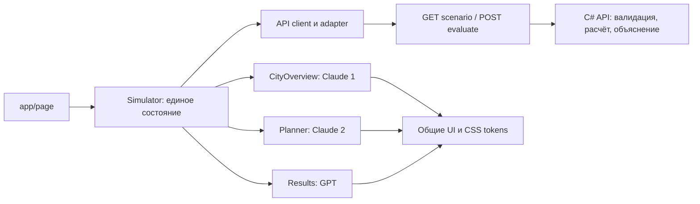

# Архитектура фронтенда «Аким на 5 часов»

Статус: архитектурный план и задания для реализации. Первичное обследование выполнено на `325da89`; commit команды `8117017` реализует C# scenario/evaluate и Docker. Тамерлан подтвердил через handoff проверку Swagger, POST по HTTP, CORS для localhost:3000 и эталон 95 / 56.54. Это подтверждение владельца API; сквозной браузерный сценарий фронтенда ещё предстоит проверить.

## Решения

1. Сохраняем Next.js 16.3.6, React 19.2.8 и существующий App Router из репозитория. Не запускаем `create-next-app` заново.
2. Один экран `/` с состояниями «Обзор», «План», «Результат». Результат существует в текущей сессии: отдельный URL с несуществующим simulation ID не нужен.
3. `app/layout.tsx` и `app/page.tsx` остаются серверной оболочкой. Интерактивный `Simulator` — клиентская граница. Сценарий загружается через API после открытия приложения; build не требует работающего C# сервера.
4. Одна модель выбора в `features/simulator/`. Компоненты обзора, планировщика и результата получают данные и callbacks через props. Компоненты не вызывают API самостоятельно.
5. Native fetch и `AbortController`; React Context + reducer для пользовательского сценария. Двух endpoints недостаточно для оправдания нескольких глобальных хранилищ.
6. CSS Modules для компонентов, общие CSS variables и reset. Сложные графики не обязательны: SVG и доступные таблицы покрывают пять районов и десять показателей.
7. Ни симуляции, ни AI-вызовов в Next.js. Для MVP браузер напрямую обращается к C# по `NEXT_PUBLIC_API_URL`; Next rewrites и `API_INTERNAL_URL` не нужны.
8. За зависимости и общий монтаж отвечает только GPT. Два Claude строят независимые модули по общему UI-контракту.

Документация Next.js подтверждает используемые границы [Server и Client Components](https://nextjs.org/docs/app/getting-started/server-and-client-components) и [структуру App Router](https://nextjs.org/docs/app/getting-started/project-structure). Выбор модулей и ролей — решение этой команды.

## Целевая структура

```text
frontend/
  AGENTS.md
  app/                         # GPT: только маршруты, оболочка, error/loading
    layout.tsx
    page.tsx
    error.tsx
    loading.tsx
  components/ui/               # Claude 1: общие визуальные примитивы
    Button.tsx
    Panel.tsx
    Badge.tsx
    Metric.tsx
    Skeleton.tsx
    index.ts
  styles/                      # Claude 1: глобальные токены и reset
    tokens.css
    globals.css
  features/
    city-overview/             # Claude 1
      CityOverview.tsx
      DistrictAtlas.tsx
      DistrictDetails.tsx
      city-overview.module.css
      index.ts
    planner/                   # Claude 2
      Planner.tsx
      MeasureCard.tsx
      DistrictPicker.tsx
      DecisionTray.tsx
      selection-rules.ts
      planner.module.css
      index.ts
    simulator/                 # GPT: композиция модулей, состояние, запросы
      Simulator.tsx
      simulator-reducer.ts
      use-simulation.ts
      simulator.module.css
    results/                   # GPT
      Results.tsx
      ScoreComparison.tsx
      DistrictComparison.tsx
      Explanation.tsx
      results.module.css
      index.ts
  lib/
    contracts/
      ui.ts                    # создан: внутренние типы и props компонентов
      api.generated.ts         # GPT: только после получения Swagger
    api/
      client.ts                # HTTP, отмена, ошибки; без бизнес-расчётов
      adapter.ts               # DTO -> UI, единственное место переименования
    format/
      numbers.ts               # ru-RU, два знака для показателей
  mocks/                       # GPT: явные fixtures для разработки и тестов
  tests/                       # GPT: API integration и сквозной сценарий
  public/city/                  # Claude 1: локальные SVG/изображения
  docs/
    architecture.md
    design.md
    acceptance.md
    backend-handoff.md
    tasks/                     # готовые задания трём аккаунтам
    reports/                   # отчёты исполнителей
  package.json                 # GPT: единственный редактор зависимостей
  package-lock.json
  next.config.ts
```

Это целевая структура, а не список уже реализованных компонентов. Создавайте файлы по мере реализации. Не создавайте пустые компоненты ради дерева.

## Границы модулей



`features/*` не импортируют внутренности соседних features. Публичные exports — из `index.ts`. Общие типы — `lib/contracts/ui.ts`. `Planner` экспортирует также чистую `validateDraft`, которой пользуется координатор перед отправкой. `validateDraft` проверяет только ограничения выбора, не рассчитывает будущие показатели.

## Поток данных и состояние

- Состояние загрузки: `loading -> ready | error`. При ошибке GET показываем повторить загрузку; бюджет и показатели не заменяем нулями.
- Готовый сценарий содержит базу, каталог и правила. UI-contract отдельно отмечает, подтверждены ли правила backend-контрактом.
- Состояние пользователя: активный шаг, выбранный для просмотра район, массив черновых решений. Фильтр каталога и раскрытая карточка остаются локальным состоянием Planner.
- Районная карточка может находиться в черновике без района. Такая карточка помечается незавершённой; отправка заблокирована. В POST незавершённые решения не попадают.
- При городской мере `districtId` отсутствует, а не равен `"city"`, `""` или `null`.
- При нажатии «Оценить решения» координатор фиксирует снимок choices и revision. На время запроса редактирование и повторная отправка блокируются; UI показывает понятную загрузку.
- Смена набора, сброс или размонтирование отменяют запрос либо инвалидируют request ID. Поздний ответ не может заменить результат другого набора.
- Успех привязывает результат к отправленному снимку. Возврат к плану сохраняет choices; первое редактирование убирает статус актуального результата.
- `400/422` сохраняют выбранные меры и показывают сообщение API. Сетевые ошибки, timeout и `5xx` показывают отдельное состояние с повтором. Не повторяем POST автоматически.
- При refresh пользователь начинает заново. Сохранение между перезагрузками, аккаунты, база и несколько команд — за рамками первой версии.

## Расчёт и отображение

До ответа API можно показать количество решений, их цены, предварительные расходы и остаток. Это арифметика формы; она не является окончательной проверкой.

Score, районные баллы, итоговые показатели и применённые синергии приходят с C#. Не вычисляйте их по датасету. Детализация реализованных эффектов по мерам пока не передаётся: `appliedEffects: null`, соответствующий раздел скрыт. Все показатели направлены одинаково: больше — лучше. Отрицательное изменение T1 у M11 должно быть заметно.

Значения API сохраняются в полученной точности; текущий API уже округляет результат до двух знаков. Форматирование `Intl.NumberFormat('ru-RU', { minimumFractionDigits: 2, maximumFractionDigits: 2 })` применяется при выводе. По согласованию с Тамерланом UI может вычитать `score - baselineScore`, `scoreAfter - scoreBefore` и `indicatorsAfter[id] - indicatorsBefore[id]` для отображения дельт. Это разница полученных значений, не повторный расчёт Score или эффектов; не пытайтесь восстановить внутреннюю неокруглённую точность сервера. В scenario районного балла нет — обзор строится по исходным показателям.

Веса и эффекты из каталога можно показывать как справку. Подпись обязательно различает «полный эффект из каталога» и «реализованный эффект за 8 кварталов». Выбранная пара до оценки — «возможная синергия», после оценки — только данные `appliedSynergies`.

## Сеть и окружение

Для MVP браузер напрямую обращается к `${NEXT_PUBLIC_API_URL}/api/scenario` и `${NEXT_PUBLIC_API_URL}/api/simulations/evaluate`. Локальное значение base URL — `http://localhost:8080`. Base URL нормализуется в одном API client, чтобы завершающий слеш не давал двойной слеш перед `/api`. Next rewrites, route proxy и `API_INTERNAL_URL` не добавляются.

Compose уже передаёт `NEXT_PUBLIC_API_URL` в build; публичное значение встраивается в клиентскую сборку. После изменения URL нужна пересборка frontend. CORS для `http://localhost:3000` подтверждён Тамерланом. Внутренний адрес контейнера `http://api:8080` браузеру не передаётся. При доступе с другого компьютера публичный URL и разрешённый origin согласует владелец сервера; localhost относится к компьютеру, где открыт браузер.

Во frontend нет `OPENAI_API_KEY`. `LLM_MODE=mock` относится к C# и всё равно использует настоящий evaluate API. Это не тот же режим, что frontend fixtures.

По handoff владельца API при сбое live LLM сервер возвращает mock-объяснение с сохранением чисел. Фронтенд отображает полученный `explanation` и не подменяет его собственными текстами. Сетевые ошибки evaluate по-прежнему обрабатываются отдельно.

## Параллельная работа и порядок сборки

| Этап | Claude 1 | Claude 2 | GPT |
| --- | --- | --- | --- |
| Первые 20 минут | Токены, примитивы, каркас CityOverview | validateDraft, каркас Planner по props | API boundary, reducer, монтаж Simulator |
| Следующие 30–40 минут | Атлас районов, показатели, адаптив | Карточки, районы, ограничения, пять слотов | Результат, запросы, ошибки, явные fixtures |
| Интеграция | Исправляет свой модуль по screenshot review | Исправляет свою логику по сценариям | Собирает модули и подключает реальный Swagger |
| Финальная проверка | Визуальные дефекты и доступность | Пограничные случаи выбора | Полный сценарий, build, отчёт для сервера |

Начальный архитектурный commit должен быть у всех трёх исполнителей. В отдельных клонах используйте ветки `feat/frontend-city`, `feat/frontend-planner`, `feat/frontend-integration`; создайте их от одного архитектурного commit. GPT интегрирует готовые commits по одному и проверяет сборку после объединения. В общем каталоге ветки не переключаются параллельно; соблюдаются области файлов.

Два Claude могут работать до Swagger на переданных props. GPT готовит только явно обозначенные фикстуры; сетевые DTO окончательно фиксируются после Swagger. Отсутствие API не оправдывает hardcode чисел внутри компонентов.

Архитектор проверяет каждый отчёт: соответствие границам, работоспособность, визуальную целостность и доказательства проверок. Между отдельными аккаунтами передаются commit или diff и отчёт — автоматический доступ к этим аккаунтам не предполагается.

Коммит и push промежуточной работы — не реже 30 минут по регламенту команды. До 15:00 приоритет — путь выбора и расчёт без LLM. С 17:15 — feature freeze, чистый compose-запуск владельцем интеграции и исправления; до 17:55 — финальный push. Если контрольная точка уже прошла, сначала восстанавливаем рабочий сквозной путь, затем добавляем визуальные улучшения.
